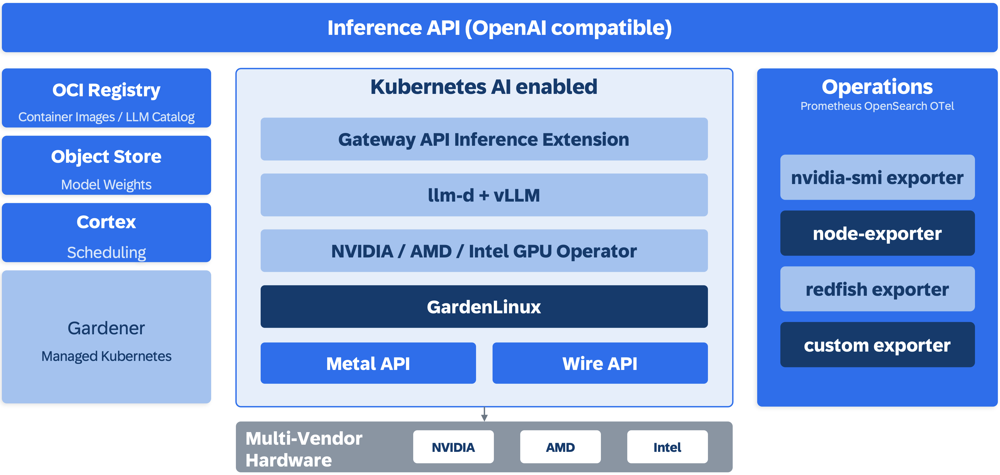

# Architecture

Thalamus is a Kubernetes-native LLM inference stack. 

It requires an AI-enabled Kubernetes cluster, for example one provided by [Gardener](https://gardener.cloud/). The underlying hardware lifecycle is managed via metal-api and wire-api. Model weights are stored in an object store, container images in an OCI registry. Thalamus' Custom Resource Definitions bundle these together as a model catalog. Operations tooling is built in via industry-standard exporters and custom extensions.

## Inference API

A single OpenAI-compatible HTTP endpoint serves all clients. Routing to the correct model and replica is handled inside the cluster by the Gateway API Inference Extension and the llm-d Endpoint Picker.

## Kubernetes AI runtime

### Gateway API Inference Extension

Model-aware HTTP routing built on the Kubernetes Gateway API. Each model is served by an `InferencePool`; requests are routed to the right pool based on the requested model.

### llm-d + vLLM

Model servers run vLLM behind llm-d, which provides KV-cache aware load balancing across the replicas of a model.

### NVIDIA / AMD / Intel GPU Operator

Vendor GPU operators install drivers and expose accelerators to the cluster as schedulable resources.

### GardenLinux

The host operating system on the cluster nodes.

### metal-api and wire-api

The bare-metal and network-fabric APIs that manage the lifecycle of the physical machines and data-center network underneath Kubernetes.

## Platform services

### Keppel

The OCI registry that hosts container images and the LLM catalog referenced by Thalamus' Custom Resource Definitions.

### Ceph

The object store that holds model weights.

### Cortex

GPU scheduling, including gang scheduling for multi-GPU model instances.

### Gardener

Managed Kubernetes. Provisions and operates the AI-enabled clusters Thalamus runs on.

## Operations

Metrics, logs, and traces flow through Prometheus, OpenSearch, and OpenTelemetry. Infrastructure and inference signals are surfaced through industry-standard exporters and custom extensions:

- **nvidia-smi exporter**: GPU utilization, memory, temperature, power
- **node-exporter**: host-level CPU, memory, disk, network
- **redfish exporter**: hardware/BMC metrics
- **custom exporters**: inference-specific metrics

## Multi-vendor hardware

Thalamus runs on commodity server hardware from multiple vendors with accelerators from NVIDIA, AMD, and Intel.

## Confidential computing

For workloads that require strong data isolation, Thalamus supports GPU confidential computing. Model weights are sealed inside an attested GPU boundary, isolated from the operator and co-tenants. Customer prompts and context are processed inside the same boundary. This enables:

- **Partner weight protection.** Proprietary weights can be deployed to infrastructure the model owner does not control.
- **Restricted-data inference.** Data that cannot leave a controlled boundary can still be processed.

## Deployment topologies

The same stack runs in two topologies:

- **Datacenter.** Full stack co-located in a managed Kubernetes cluster.
- **Satellite.** Air-gapped subset of the stack at the edge. The satellite carries its own OCI registry, inference gateway, model instances, and monitoring; the central datacenter retains the source-of-truth registry, object store, model catalog, and identity provider.

## Related

- [Model CRD API Reference](/reference/model-crd-api)
- [Getting Started](/getting-started)
